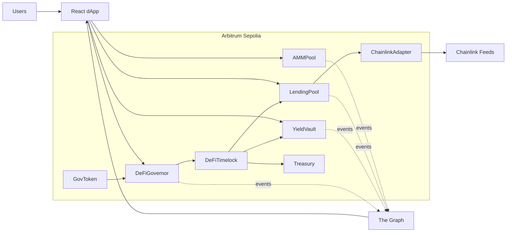

# DeFi Super-App

DeFi Super-App is a full-stack Solidity and React protocol built for Arbitrum Sepolia. It includes governance tokens, a constant-product AMM, lending market, ERC-4626 yield vault, Chainlink oracle adapter, DAO governance, timelock treasury control, The Graph indexer, and a wagmi/RainbowKit frontend.

## Architecture



More detail:

- `docs/ARCHITECTURE.md`
- `docs/SECURITY_AUDIT.md`
- `docs/GAS_REPORT.md`

## Contracts

| Area | Contracts |
| --- | --- |
| Tokens | `GovToken`, `LPToken` |
| AMM | `AMMPool`, `AMMPoolV2`, `AMMFactory` |
| Lending | `LendingPool`, `InterestRateModel` |
| Vault | `YieldVault` |
| Oracle | `ChainlinkAdapter` |
| Governance | `DeFiGovernor`, `DeFiTimelock`, `Treasury` |

## Quick Start

Install Foundry:

```bash
curl -L https://foundry.paradigm.xyz | bash
foundryup
```

Install dependencies:

```bash
forge install OpenZeppelin/openzeppelin-contracts
forge install OpenZeppelin/openzeppelin-contracts-upgradeable
forge install foundry-rs/forge-std
```

Build and test:

```bash
forge build
forge test
```

Run coverage:

```bash
forge coverage
```

Coverage output should be saved to:

```bash
coverage/coverage.md
```

## Environment Setup

Create `.env`:

```bash
DEPLOYER_ADDRESS=0xYourDeployer
PRIVATE_KEY=0xYourPrivateKey
ARBITRUM_SEPOLIA_RPC_URL=https://sepolia-rollup.arbitrum.io/rpc
MAINNET_RPC_URL=https://eth-mainnet.g.alchemy.com/v2/YOUR_KEY
TOKEN_A=0xTokenA
TOKEN_B=0xTokenB
COLLATERAL_TOKEN=0xCollateralToken
BORROW_TOKEN=0xBorrowToken
BENCHMARK_USER=0xBenchmarkUser
```

Load the environment:

```bash
source .env
```

On PowerShell:

```powershell
$env:DEPLOYER_ADDRESS="0xYourDeployer"
$env:PRIVATE_KEY="0xYourPrivateKey"
$env:ARBITRUM_SEPOLIA_RPC_URL="https://sepolia-rollup.arbitrum.io/rpc"
```

## Deployment

Deployment script:

```bash
forge script script/Deploy.s.sol:Deploy \
  --rpc-url $ARBITRUM_SEPOLIA_RPC_URL \
  --private-key $PRIVATE_KEY \
  --broadcast \
  --verify
```

Post-deployment verification:

```bash
forge script script/Verify.s.sol:Verify \
  --rpc-url $ARBITRUM_SEPOLIA_RPC_URL
```

Gas benchmark:

```bash
forge script script/GasBenchmark.s.sol:GasBenchmark
```

Deployment output:

- `deployments/421614.json`

## Deployed Contract Addresses

Arbitrum Sepolia deployment template:

| Contract | Address |
| --- | --- |
| GovToken | `0x0000000000000000000000000000000000000000` |
| InterestRateModel | `0x0000000000000000000000000000000000000000` |
| ChainlinkAdapter | `0x0000000000000000000000000000000000000000` |
| AMMFactory | `0x0000000000000000000000000000000000000000` |
| AMMPool | `0x0000000000000000000000000000000000000000` |
| LendingPool Proxy | `0x0000000000000000000000000000000000000000` |
| YieldVault Proxy | `0x0000000000000000000000000000000000000000` |
| DeFiTimelock | `0x0000000000000000000000000000000000000000` |
| DeFiGovernor | `0x0000000000000000000000000000000000000000` |

Arbiscan links are generated in `deployments/421614.json`.

## Subgraph

Subgraph directory:

```bash
subgraph/
```

Install Graph CLI and dependencies:

```bash
npm install -g @graphprotocol/graph-cli
cd subgraph
graph codegen
graph build
```

Subgraph endpoint URL:

```text
https://api.studio.thegraph.com/query/00000/defi-super-app/version/latest
```

Replace the placeholder with the deployed Studio endpoint after publishing.

## Frontend

Frontend directory:

```bash
frontend/
```

Install and run:

```bash
cd frontend
npm install
npm run dev
```

Required frontend environment:

```bash
VITE_ALCHEMY_RPC_URL=https://arb-sepolia.g.alchemy.com/v2/YOUR_KEY
VITE_WALLETCONNECT_PROJECT_ID=your_walletconnect_project_id
VITE_SUBGRAPH_URL=https://api.studio.thegraph.com/query/00000/defi-super-app/version/latest
```

The frontend uses:

- wagmi v2
- viem v2
- RainbowKit
- TanStack Query
- graphql-request

## Slither

Install:

```bash
pipx install slither-analyzer
```

Run:

```bash
slither src/ --exclude-informational
```

Paste output and triage notes into:

```bash
docs/SECURITY_AUDIT.md
```

## Testing Scope

Unit and security tests cover:

- Governance token voting and delegation
- AMM liquidity, swap, UUPS upgrade, factory CREATE2
- Lending deposits, withdrawals, borrows, repayments, liquidations
- ERC-4626 vault invariants
- Governance propose, vote, queue, execute lifecycle
- Reentrancy case study
- Access-control case study
- Fork integrations for Chainlink, USDC, and Uniswap V2

## Team Members and Ownership Areas

| Area | Owner |
| --- | --- |
| Token layer | Team member TBD |
| AMM and factory | Team member TBD |
| Lending and vault | Team member TBD |
| Governance and treasury | Team member TBD |
| Security review | Team member TBD |
| Subgraph and frontend | Team member TBD |
| Deployment and documentation | Team member TBD |

## Commit Messages

Deployment:

```text
feat(deploy): add idempotent deployment script, post-deployment verification, and gas benchmark
```

Documentation:

```text
docs: add architecture document, security audit report, gas optimization report, and README
```
