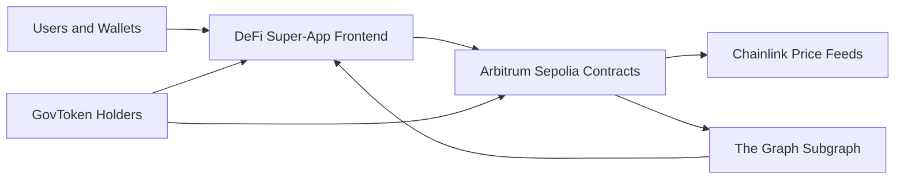
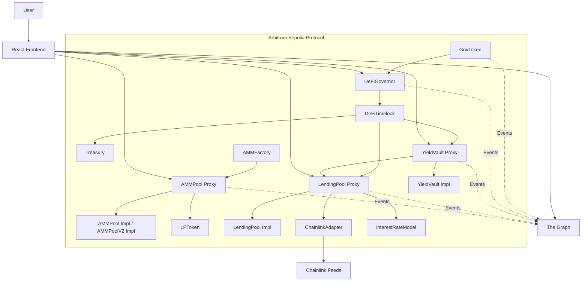
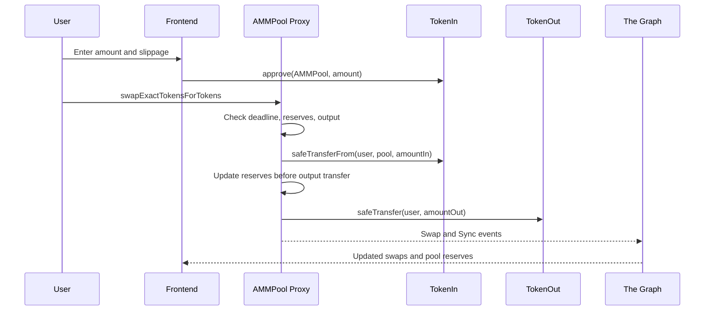
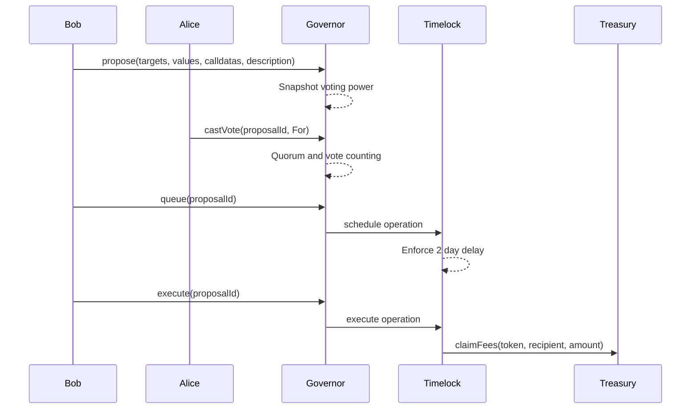
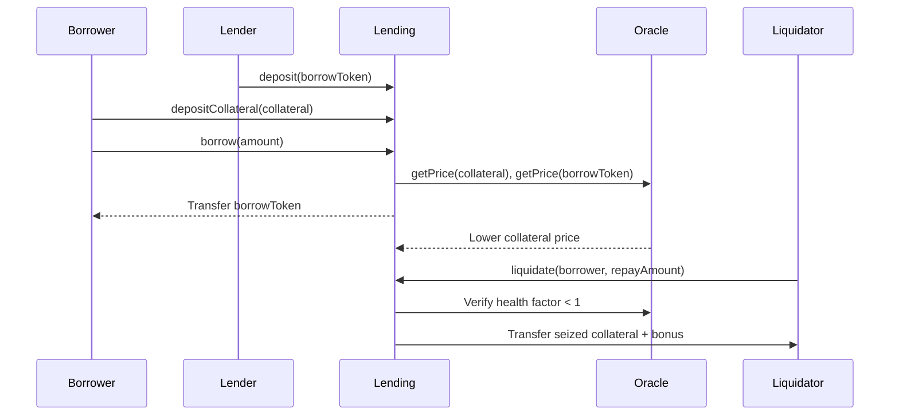

# DeFi Super-App Architecture

## 1. System Context

The DeFi Super-App is an Arbitrum Sepolia protocol composed of token, AMM, lending, vault, oracle, governance, indexing, and frontend layers. Users interact through the React dApp, wallets sign transactions, contracts execute protocol state transitions, and The Graph indexes events for fast reads.

Key external systems:

| System | Purpose | Failure Mode |
| --- | --- | --- |
| Arbitrum Sepolia | Execution environment | Transactions cannot settle if sequencer or RPC is unavailable |
| Chainlink | Price data for health factor and liquidation | Stale or invalid prices cause protected actions to revert |
| The Graph | Indexed read API for frontend dashboards | Frontend analytics degrade; direct contract writes still work |
| Wallets | Account custody and signing | User-side key compromise can drain user funds |

## 2. Container Diagram

Ownership model:

| Component | Owner / Admin | Upgrade Path |
| --- | --- | --- |
| AMMPool proxy | Initially factory/deployer, can be transferred to Timelock | UUPS `_authorizeUpgrade` onlyOwner |
| LendingPool proxy | DeFiTimelock after deployment | UUPS `_authorizeUpgrade` onlyOwner |
| YieldVault proxy | DeFiTimelock after deployment | UUPS `_authorizeUpgrade` onlyOwner |
| Treasury | DeFiTimelock role | No upgrade path |
| ChainlinkAdapter | Deployer unless transferred by deployment extension | Ownable feed management |
| Timelock | Self-admin after bootstrap | Role changes must go through delay |

## 3. Storage Layouts

Upgradeable contracts are UUPS proxies. The proxy stores implementation metadata in ERC-1967 slots. Application variables are stored in the implementation layout and must only be appended in upgrades.

### AMMPool V1

| Slot | Variable | Type | Size |
| --- | --- | --- | --- |
| 0 | Initializable bookkeeping | OZ internal | 32 bytes |
| 1 | OwnableUpgradeable owner | address | 20 bytes |
| 2 | ReentrancyGuardUpgradeable status | uint256 | 32 bytes |
| 3 | tokenA | address | 20 bytes |
| 4 | tokenB | address | 20 bytes |
| 5 | reserveA, reserveB, blockTimestampLast | uint112, uint112, uint32 | packed 32 bytes |
| 6 | lpToken | LPToken | 20 bytes |
| 7 | kLast | uint256 | 32 bytes |

### AMMPool V2

| Slot | Variable | Type | Size |
| --- | --- | --- | --- |
| 0-7 | AMMPool V1 variables | unchanged | unchanged |
| 8 | protocolFeeEnabled | bool | 1 byte |
| 9 | feeTo | address | 20 bytes |

No collision exists because V2 appends new variables after V1 slot 7. No V1 variable was reordered, resized, deleted, or inserted before existing slots.

### LendingPool

| Slot | Variable | Type | Size |
| --- | --- | --- | --- |
| 0 | Initializable bookkeeping | OZ internal | 32 bytes |
| 1 | OwnableUpgradeable owner | address | 20 bytes |
| 2 | ReentrancyGuardUpgradeable status | uint256 | 32 bytes |
| 3 | PausableUpgradeable paused flag | bool | 1 byte |
| 4 | _deposits | mapping(address => uint256) | mapping slot |
| 5 | borrows | mapping(address => uint256) | mapping slot |
| 6 | borrowIndex | mapping(address => uint256) | mapping slot |
| 7 | collateralBalance | mapping(address => uint256) | mapping slot |
| 8 | depositIndex | mapping(address => uint256) | mapping slot |
| 9 | totalDeposits | uint256 | 32 bytes |
| 10 | totalBorrows | uint256 | 32 bytes |
| 11 | globalBorrowIndex | uint256 | 32 bytes |
| 12 | globalDepositIndex | uint256 | 32 bytes |
| 13 | lastAccrualTimestamp | uint256 | 32 bytes |
| 14 | oracle | ChainlinkAdapter | 20 bytes |
| 15 | interestRateModel | InterestRateModel | 20 bytes |
| 16 | collateralToken | address | 20 bytes |
| 17 | borrowToken | address | 20 bytes |

### YieldVault

| Slot | Variable | Type | Size |
| --- | --- | --- | --- |
| 0 | Initializable bookkeeping | OZ internal | 32 bytes |
| 1+ | ERC20Upgradeable / ERC4626Upgradeable state | OZ internal | multiple |
| next | OwnableUpgradeable owner | address | 20 bytes |
| next | UUPSUpgradeable state | OZ internal | multiple |
| next | PausableUpgradeable paused flag | bool | 1 byte |
| next | lendingPool | LendingPool | 20 bytes |

YieldVault inherits OpenZeppelin upgradeable ERC-4626 storage. Future versions must append local state after `lendingPool` and must not alter inherited order.

## 4. Sequence Diagrams

### Flow 1: Swap

### Flow 2: Governance Lifecycle

### Flow 3: Borrow, Price Drop, Liquidation

## 5. Trust Assumptions

| Actor | Powers | Risk if compromised | Mitigation |
| --- | --- | --- | --- |
| Deployer | Initial setup, role grants, deployment configuration | Could deploy wrong addresses or retain role if step 7 skipped | Verify script checks revoke admin; post-deploy verification enforces no admin backdoor |
| Timelock | Owns protocol upgrades, pauses, treasury claims | Can execute malicious proposal after delay | 2-day delay, public execution, governance visibility |
| Governor | Queues proposals to timelock | Malicious majority can pass harmful changes | 4% quorum, 1% threshold, voting delay and voting period |
| Chainlink | Price source for lending | Bad feed can create bad borrows/liquidations | Staleness and non-positive price checks; governance can update feeds |
| The Graph | Indexed frontend reads | Outage or incorrect index data can mislead UI | Writes use contracts directly; users can verify on block explorer |
| Frontend host | User interface | Malicious UI could request bad transactions | Contract addresses public; wallet transaction review; open-source code |

## 6. Architecture Decision Records

### ADR-001: UUPS over Transparent Proxy

Decision: Use UUPS proxies for AMMPool, LendingPool, and YieldVault.

Rationale: UUPS keeps upgrade logic in the implementation and reduces proxy deployment overhead. Ownership checks live in `_authorizeUpgrade`, which aligns with timelock governance ownership.

Tradeoff: Implementation code must be carefully reviewed to preserve upgrade authorization. Transparent proxies isolate admin logic in the proxy but add operational complexity.

### ADR-002: Constant-Product AMM over Concentrated Liquidity

Decision: Implement x*y=k AMM rather than Uniswap V3 style concentrated liquidity.

Rationale: Constant-product AMMs are easier to audit, test, and index. The project objective is a complete DeFi primitive with understandable reserves, swaps, and LP token accounting.

Tradeoff: Capital efficiency is lower than concentrated liquidity.

### ADR-003: Linear Interest Rate Model over Kinked Model

Decision: Use base rate plus utilization slope.

Rationale: A linear model is transparent and sufficient for a single-market lending implementation. It keeps borrow and supply rate reasoning simple for tests and documentation.

Tradeoff: It does not sharply discourage near-100% utilization the way a kinked model does.

### ADR-004: Arbitrum Sepolia over Optimism Sepolia

Decision: Target Arbitrum Sepolia.

Rationale: Arbitrum Sepolia has mature tooling, public RPC endpoints, Chainlink feeds, Arbiscan verification, and strong EVM compatibility.

Tradeoff: L2-specific gas behavior differs from mainnet and other rollups, so gas reports must be chain-specific.

### ADR-005: ERC-4626 Vault Deposits into LendingPool

Decision: YieldVault forwards assets into LendingPool.

Rationale: ERC-4626 standardizes deposits, withdrawals, shares, previews, and integrations. LendingPool yield becomes composable through vault shares.

Tradeoff: Vault liquidity depends on LendingPool available liquidity. Withdrawals can fail when utilization is too high.

## 7. Design Patterns Used

| Pattern | Where Used | Why It Fits |
| --- | --- | --- |
| Checks-Effects-Interactions | AMM, LendingPool, Treasury | Reduces reentrancy risk by updating state before external transfers |
| Reentrancy Guard | AMMPool, LendingPool | Protects token callback and liquidation paths |
| UUPS Proxy | AMMPool, LendingPool, YieldVault | Enables governance-controlled upgrades with minimal proxy overhead |
| Factory | AMMFactory | Standardizes deterministic pair deployment and pair lookup |
| Timelock Governance | DeFiGovernor + DeFiTimelock | Gives token holders transparent delayed control |
| Oracle Adapter | ChainlinkAdapter | Isolates feed validation and staleness checks |
| ERC-4626 Adapter | YieldVault | Exposes lending deposits through a standard vault interface |
